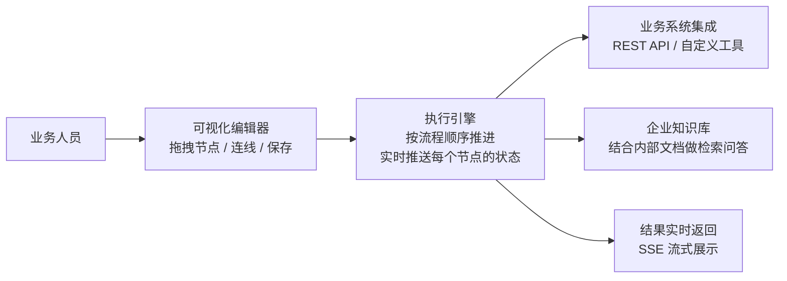
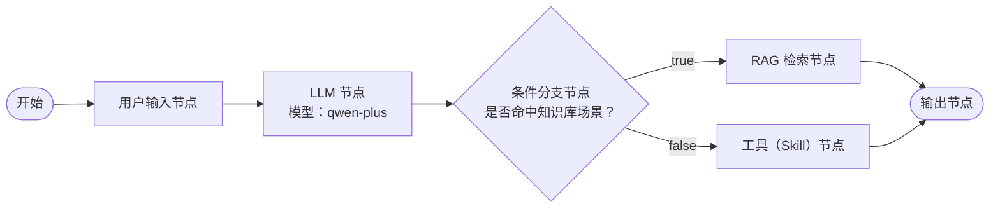
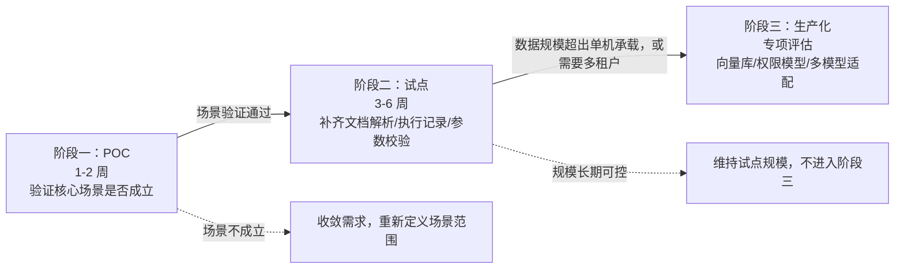
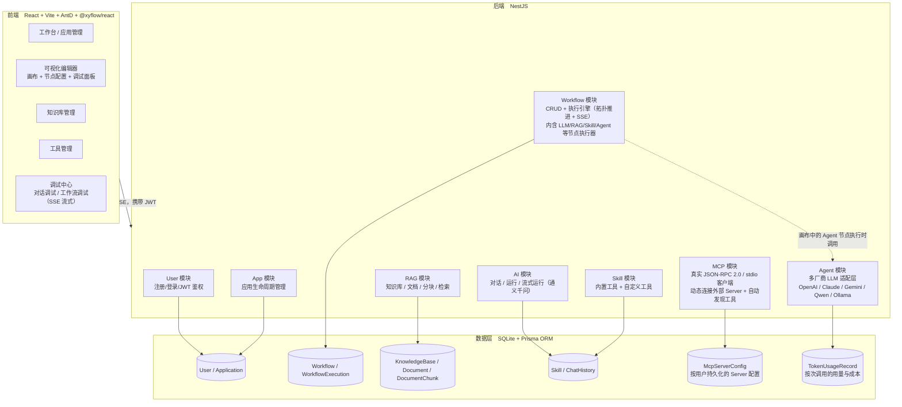

# Make Your Own Flow Studio：把 AI 应用搭建从"写代码"变成"可视化编排" —— 技术解决方案

**文档类型**：售前技术解决方案
**适用读者**：客户技术负责人、业务负责人
**方案定位**：本方案基于 Make Your Own Flow Studio
---

## 一、预设客户场景与核心问题

某 AI 应用团队正面临这样的困境：业务部门不断提出新的 AI 场景需求——客服问答、内部文档检索、内容生成——但每个场景都需要研发从零写调用链路：接 LLM、接检索、接内部系统 API，再手工串成一条流程。一个新场景从提出到上线，平均要占用研发 2-3 周排期，需求积压了一个季度都消化不完。业务方想自己调整一下 Prompt 或者换个判断逻辑，也必须重新排研发资源、走一次发版流程。

用一个典型场景做量化参考：一个"客服问答 + 知识库检索"场景，从需求提出到第一个可用版本上线，常见的时间分布是——流程编排与接口对接占大头（约 2 周），真正花在业务逻辑本身调优的时间反而只有一小部分（约 1 周）。也就是说，多数时间被"胶水代码"占用了，而不是被业务判断本身占用。

更麻烦的是，流程上线后一旦效果不对，业务方只能反馈"AI 回答得不对"，具体是哪一步出的问题、模型没接对还是检索没召回、参数传错了没有，只有研发翻日志才能定位，反馈到修复往往要拖几天。

这类问题的核心卡点，不是"有没有大模型能力"，而是**业务场景转化为可用 AI 流程的效率太低、过程太不透明**。

Make Your Own Flow Studio 要解决的正是这个问题：把 AI 应用的搭建方式从"研发写代码串流程"变成"在画布上可视化编排"，把执行过程从"黑盒日志"变成"节点级实时可观测"，让业务方能够参与验证、研发不用为每个新场景重复造轮子。

## 二、方案目标

| 目标 | 客户可感知的衡量标准 |
|---|---|
| **降低搭建门槛** | 具备基础参数配置能力的业务人员，经过约 1 小时的界面讲解，即可独立搭建一个"问答 + 知识库检索"的简单工作流并跑通，不需要写代码 |
| **执行过程可观测** | 流程出问题时，业务方可以直接指出"是哪一个节点失败/被跳过"，并把节点状态截图给研发定位，而不是只能反馈"系统报错了" |
| **能力可插拔、可复用** | 新增一个内部系统 API 作为工具，业务方在界面上配置 HTTP 地址即可接入，不需要研发改动编排引擎代码；同一个知识库、同一个工具可以被多个应用复用 |

**总时间预期**：基于现有的 docker-compose 环境和自带种子数据，目标是从环境启动到看到第一个工作流跑通结果，控制在 1 小时以内完成。具体耗时会受客户网络环境、硬件配置影响，建议在 POC 阶段现场实测，而不是提前照搬这个数字。

## 三、业务视角：这套系统是怎么被使用的



图示说明的是一条完整闭环：业务人员在画布上拖拽出一个流程并保存，执行引擎按流程推进并把每一步的状态实时推给前端，中间可以随时调用客户自己的系统接口，也可以结合企业已有文档做检索问答，最终结果流式返回给用户。

**角色与职责**：

- **业务人员**：在画布上拖拽节点、配置参数、保存并运行工作流，不需要理解后端架构。
- **研发人员**：负责把客户内部系统的 API 接入为自定义工具、准备知识库文档、处理异常场景兜底，不需要为每个新业务场景单独写编排代码。
- **协作方式**：业务人员先把流程搭起来、自己跑通基本场景，研发人员再介入检查参数配置和安全设置，确认无误后上线——分工边界清晰，避免所有环节都堆在研发身上。

## 四、核心能力与客户场景对照

下表按**客户可能会遇到的场景**来组织：

| 场景 | 对应能力 | 实现程度 |
|---|---|---|
| 业务方想快速验证一个新的 AI 场景，不想等研发排期 | 可视化编排（画布拖拽、7 种节点类型）+ 调试中心（对话/工作流调试） | ✅ 已实现，画布搭建 + 即时运行验证 |
| 线上流程跑出问题，需要精确定位是哪一步出错 | 执行引擎的节点级状态推送（`running`/`success`/`failed`/`skipped`），SSE 实时展示 | ✅ 已实现，可定位到具体节点和上下文数据 |
| 想把公司内部系统的 API 接入到 AI 流程里，不想让研发单独开发对接代码 | 自定义工具（Skill）节点，界面配置 HTTP 地址即可调用 | ✅ 已实现，新增工具不改动编排引擎 |
| 需要基于公司内部文档做检索增强问答 | 知识库管理 + RAG 检索节点，支持上传、切分、向量化、Top-K 检索 | ✅ 已实现（当前限文本类文档，能力边界见第七章） |
| 需要同时管理多个 AI 应用，按需上线/下线 | 应用生命周期管理（草稿 / 已发布 / 已归档） | ✅ 已实现 |
| 需要保护不同用户各自的账号和资产 | 基于 JWT 的用户注册/登录/鉴权 | ✅ 已实现（多租户级权限细化见第七章） |
| 想用 OpenAI / Claude / Gemini / Ollama 等其他厂商的模型，而不是被单一供应商锁定 | Agent 节点内置多厂商 LLM 适配层，客户提供对应厂商的 API Key 即可调用真实厂商接口 | ✅ 已实现，但仅在 Agent 节点生效（工作流画布最常用的 LLM 节点目前仍固定走通义千问兼容接口，说明见第七章） |
| 想把自己搭建的 MCP Server 接入进来，让工具动态可用 | MCP 模块：真实的 JSON-RPC 2.0 / stdio 协议客户端，可动态连接/断开外部 MCP Server 并自动发现其工具 | ✅ 已实现（当前仅支持 stdio 传输、连接为内存态，且暂未接入 AI 的工具调用链路，说明见第七章） |

### 4.1 示例：一个真实可运行的工作流

以下是"多轮问答 + 条件分支"场景在画布上编排出的实际结构，用于直观说明"可视化编排"具体编排的是什么，而不是抽象概念：



该流程运行时，前端会通过 SSE 实时接收每个节点的状态，条件分支未命中的一侧会被标记为 `skipped` 而不是直接消失——这一点在第九章的演示环节会现场展示，方便业务方直观理解"为什么这条分支没有执行"。

## 五、为什么选择 Make Your Own Flow Studio

一个常见的追问是："我也可以自己用 LangChain 搭一套，或者基于 Dify / Coze 这类通用平台做二次开发，为什么选你？"

下表是几种常见路径的方向性对比，帮助你判断在自己的场景下该怎么选（具体数值会因团队和场景差异较大，建议结合自身情况和实际 POC 结果验证，而非直接采信）：

| 对比维度 | 自研（如基于 LangChain 从零搭建） | 通用 AI 应用平台（如 Dify / Coze 类） | Make Your Own Flow Studio |
|---|---|---|---|
| 上手速度 | 需要自建编排框架、执行引擎、状态管理，起步周期以周计 | 开箱即用，但流程逻辑和节点类型受限于平台预设 | 提供开箱即用的编排引擎 + 可观测执行，首个工作流可当场搭建验证 |
| 可定制性 | 高，但每一层都要自己维护 | 通常较低，深度定制需要绕开平台限制 | 工具（Skill）、节点、模型接入均可扩展，代码可控、可二次开发 |
| 执行可观测性 | 需要自建日志/监控体系 | 依赖平台自带能力，通常不对外开放深度定制 | 节点级 SSE 状态推送原生内置，后续可对接客户自有监控体系 |
| 部署方式 | 自建，灵活但运维成本由自己承担 | 多为 SaaS 优先，私有化部署需另行评估 | 代码可控，支持本地/私有化部署（已提供 docker-compose） |
| 数据与合规 | 自主可控 | 需确认数据是否出境、是否符合内部合规要求 | 部署在客户环境内，数据不出私有网络 |

这张表的目的不是说"平台一定比自研或通用平台好"，而是帮你想清楚：如果你的诉求是**可控、可定制、且能快速看到业务场景跑通**，这条路径通常比从零自研更快，也比受限于通用平台预设逻辑更灵活。

**适用人群**：

- 团队研发资源充足、时间不紧、且对流程有很深的定制诉求，自研是长期最可控的路径，但要为前期基础设施建设的时间成本做好预期。
- 团队只是想快速验证一个场景、不想在基础设施上投入精力，通用平台上手最快，代价是深度定制和数据合规上会受限于平台本身。
- 团队既要快速验证，又要求代码可控、数据不出私有环境，Make Your Own Flow Studio 提供的是中间路径——开箱即用起步，但底层代码可扩展、可二次开发，不会被锁死在别人的平台规则里。

## 六、建议实施路径（分阶段落地）

按照"先验证、再试点、后生产化"的推进节奏，建议分三阶段推进，下图给出整体推进逻辑与阶段间的判断依据：



是否进入下一阶段，取决于真实的数据规模与并发要求。

### 阶段一：功能验证 POC（当前代码可直接支撑，1-2 周）
- 目标：验证核心场景是否成立——是否能用画布搭出你的一个真实业务流程（如"问答 + 知识库检索"或"多轮对话 + 条件分支"）。
- 交付物：1-2 个跑通的示例工作流 + 现场演示（演示脚本见第九章）。

**POC 前置对接清单**：

| 事项 | 具体要求 | 备注 |
|---|---|---|
| 业务文档 | 提供 1-2 份 `.txt` 或 `.md` 格式的真实业务文档，用于知识库验证 | 若只有 PDF/DOCX，提前告知我们，评估是否需要在 POC 前先做解析器适配（否则内容读取不出来） |
| LLM 接口 | 默认使用平台已对接的通义千问兼容接口，POC 阶段无需客户额外提供 | 若客户已有自建/私有化模型接口，建议 POC 阶段先用默认接口验证场景是否成立，切换自有模型放到阶段二，避免两个变量一起排查 |
| 业务系统 API（可选） | 若 POC 范围包含"调用客户内部系统"的场景，需提供对应 API 的地址、鉴权方式和一个可测试的调用示例 | 不涉及则跳过 |

### 阶段二：小范围试点（需要补齐能力，视场景 3-6 周）
在 POC 验证方向成立后，试点阶段通常需要补齐：
- 文档格式扩展（当前仅支持纯文本类文件，PDF/DOCX 需要额外解析器）
- 工作流执行记录完整落库（当前 `WorkflowExecution` 表存在但执行主流程未完整写入，无法做历史审计）
- 更严格的自定义工具参数校验（防止试点期间因参数错误导致误调用）
- 视客户需求接入其真实业务系统的 API 作为自定义工具
- 按客户需要的模型厂商，协助配置对应的 API Key（当前 Qwen Key 为必需项，OpenAI/Claude/Gemini 等厂商 Key 由客户自行提供）
- 打通 MCP 已连接的外部工具到 AI 的工具调用链路（当前 MCP 能连接外部 Server 并发现工具，但还只是独立的管理/测试入口，AI 执行时还调用不到）

### 阶段三：生产化落地（视规模评估，需专项设计）
- 向量检索：从"内存计算余弦相似度"迁移到独立向量数据库（当前方案仅适合小规模文档，量级增大后检索延迟和内存占用会明显上升）
- 数据库：从 SQLite 迁移到生产级数据库（如 PostgreSQL），评估多实例部署下的并发写入
- 多租户与权限细化：当前鉴权解决"谁登录"，生产环境通常还需要组织/团队级别的数据隔离与权限模型
- 模型路由打通：Agent 节点已具备多厂商适配层，但工作流画布最常用的 LLM 节点目前仍固定走通义千问兼容接口，需要打通两者的路由逻辑，并把非 Qwen 厂商的 Key 补充进标准环境变量校验
- MCP 能力补强：当前仅支持 stdio 传输（SSE/HTTP 已预留字段但尚未启用），连接为内存态（服务重启需手动重连），需要补齐传输方式和连接持久化

如果客户场景本身规模小、单机可承载，阶段三的部分内容可以长期不做——是否推进完全取决于真实的数据规模和并发要求。

## 七、当前阶段侧重点与后续演进路径

Make Your Own Flow Studio 当前阶段聚焦于**场景验证**：核心能力是可视化编排、可观测执行、知识库检索、自定义工具接入，这些都已经跑通并可以直接演示。以下几项能力当前阶段暂未覆盖，但都有明确的演进路径，不是被回避的问题：

| 能力 | 当前状态 | 后续演进路径 | 涉及阶段 |
|---|---|---|---|
| 文档解析 | 支持文本类文件（txt/md/json/csv/log/yaml） | 接入 PDF/DOCX 等二进制文档解析器 | 阶段二 |
| 执行历史 | 节点级状态实时推送，未完整落库 | 完整写入 `WorkflowExecution`，支持历史追溯与审计报表 | 阶段二 |
| 向量检索 | 内存计算余弦相似度，适合小规模文档 | 接入独立向量数据库，支持大规模文档与低延迟检索 | 阶段三 |
| 多租户权限 | JWT 单用户鉴权 | 组织/团队级别的数据隔离与权限模型 | 阶段三 |
| MCP 生态 | 已实现真实 MCP 协议客户端（JSON-RPC 2.0 + stdio），支持动态连接/断开外部 MCP Server 并自动发现工具；仅支持 stdio 传输，连接为内存态，且暂未接入 AI 的工具调用链路 | 打通到 AI 工具调用链路、补充 SSE/HTTP 传输、连接持久化 | 阶段二 / 阶段三 |
| 模型供应商 | Agent 节点已有多厂商适配层（OpenAI/Claude/Gemini/Qwen/Ollama），提供对应 API Key 即可调用真实厂商接口；但工作流画布最常用的 LLM 节点目前仍固定走通义千问兼容接口，尚未接入该适配层 | 打通 LLM 节点与 Agent 节点的路由逻辑，把非 Qwen 厂商 Key 补充进标准环境变量校验 | 阶段二 / 阶段三 |

## 八、非功能性需求现状对照

| 维度 | 当前状态 | 生产环境通常要求 | 差距说明 |
|---|---|---|---|
| 鉴权 | JWT 单用户体系 | 组织/团队级 RBAC | 需要角色与数据隔离设计 |
| 数据存储 | SQLite 单文件 | 高可用数据库 + 备份策略 | 迁移成本可控，建议阶段三处理 |
| 检索性能 | 内存计算，无索引 | 向量数据库 + ANN 索引 | 文档量级超过数千条后需要升级 |
| 可观测性 | 节点级 SSE 状态推送 | 执行历史落库 + 监控告警 | 执行记录需要补齐 |
| 部署方式 | 本地 npm 启动 / docker-compose | 容器化 + CI/CD | 已有 docker-compose，可作为起点 |

## 九、验收与演示路径建议

建议按以下顺序组织客户演示，每一步都能独立验证一个能力点，便于业务方和技术负责人在评审会上逐条确认：

1. **登录验证**：使用测试账号登录，确认鉴权链路可用。
2. **知识库验证**：查看知识库中已有文档，现场上传一份客户提供的文本类文档（`.txt`/`.md`），确认切分与检索生效。
3. **对话 + RAG 验证**：在调试中心选择该知识库，提问一个与文档内容相关的问题，观察流式返回与引用效果。
4. **工作流验证**：打开一个应用编辑器，现场搭建或运行一个包含"开始 → 用户输入 → 大模型 → 条件分支 → 输出"的工作流，输入 JSON 参数运行，观察节点级状态变化（running/success/failed/skipped）与最终输出。
5. **工具验证**：在工具管理页面执行一个内置工具（如 HTTP 请求），确认参数输入与返回结果可视化。

演示的核心目的不是展示界面美观度，而是让客户亲眼确认"编排"与"可观测执行"这两个核心卖点是真实可用的，而不是设计稿。

## 十、风险与应对

| 风险 | 影响 | 应对建议 |
|---|---|---|
| 客户文档以 PDF/扫描件为主 | RAG 效果验证会受阻 | POC 前置沟通，提前确认文档格式，或将 PDF 解析列入试点阶段范围 |
| 客户需要用非 Qwen 厂商模型（OpenAI/Claude/Gemini 等） | Agent 节点已支持真实多厂商调用，但需要客户提供对应厂商的 API Key，且目前只有 Agent 节点接入了这层适配，工作流画布的 LLM 节点还没有 | 提前确认客户要在哪个节点类型上用哪家模型，按需协助配置 Key 或引导使用 Agent 节点 |
| 客户误以为"MCP 已连接外部 Server"等于"AI 已经能调用这些外部工具" | MCP 目前是独立的管理/测试入口，还没有接入 AI 的工具调用链路，容易产生预期落差 | POC 演示时明确说明现状边界，若客户场景确实需要，纳入阶段二打通计划 |
| 数据规模超出预期 | 内存检索方案性能下降 | 试点阶段设置数据量阈值，超过阈值触发向量数据库升级评估 |
| 客户误将 POC 效果等同于生产可用性 | 后续验收产生落差、影响信任 | 方案评审时明确同步第七章的能力边界，书面确认阶段划分 |

## 十一、附录：技术架构详情

以下内容面向客户的架构师/技术负责人做技术尽调时查阅，不作为客户业务侧演示的主线内容。

### 11.1 架构分层



> 图示说明：前端通过 REST 接口完成常规操作，通过 SSE 长连接接收工作流/对话的流式状态与内容。MCP 模块是独立实现的真实协议客户端，可连接外部 MCP Server 并自动发现工具，但目前只是管理/测试入口，尚未接入 AI 的工具调用链路（现状与差距见第七章）。Agent 模块提供真正的多厂商 LLM 适配能力，按厂商提供 API Key 即可调用真实厂商接口，但目前只作为工作流画布里的一种节点类型存在，没有独立的管理页面。

### 11.2 技术选型说明

| 层级 | 选型 | 选择原因 |
|---|---|---|
| 前端框架 | React + TypeScript + Vite | 生态成熟、类型安全，适合复杂交互（画布、表单联动） |
| 状态管理 | Zustand | 相比 Redux 心智负担更低，适合"画布 + 节点状态"这类高频局部更新场景 |
| 编排引擎 | @xyflow/react | 原生支持 DAG（节点+边）结构，具备拖拽/连线/缩放能力，可定制节点类型 |
| 后端框架 | NestJS | 模块化、依赖注入，适合中大型后端工程的可维护性要求 |
| ORM/数据库 | Prisma + SQLite | 当前阶段以快速验证、单机部署为目标，Schema 迁移可控 |
| 流式通信 | SSE | AI 输出场景是单向流，SSE 基于 HTTP 实现简单、自带重连语义，比 WebSocket 更轻量 |
| 鉴权 | JWT | 无状态、前后端分离场景下的标准做法 |

> 说明：以上选型服务于**当前阶段**（原型/小规模验证）。第六章说明了走向生产环境时哪些选型需要升级（例如 SQLite → 生产级数据库、内存余弦检索 → 向量数据库）。

### 11.3 环境要求
- Node.js 18+，npm 9+
- 已提供 `docker-compose.yml`，可用于容器化启动验证环境

### 11.4 关键接口一览（节选）
- 鉴权：`POST /api/users/register`、`POST /api/users/login`
- 应用：`POST /api/apps`、`GET /api/apps`、`PATCH /api/apps/:id/publish`
- 工作流：`POST /api/workflows/:id/run`、`POST /api/workflows/:id/run/stream`
- RAG：`POST /api/rag/documents/upload`、`POST /api/rag/retrieve`
- AI：`POST /api/ai/chat`、`POST /api/ai/stream-run`
- 工具：`POST /api/skill/:id/execute`
- MCP：`POST /api/mcp/servers`（新增 Server 配置）、`POST /api/mcp/servers/:id/connect`、`POST /api/mcp/servers/:id/disconnect`、`GET /api/mcp/servers/:id/tools`、`POST /api/mcp/servers/:id/tools/call`、`GET /api/mcp/tools`（聚合已连接 Server 的全部工具）
- 模型与用量（Agent 模块）：`GET /api/llm/models`（模型目录）、`GET /api/token-usage`（按次用量与成本）

### 11.5 快速部署方式（本地验证）
```bash
# 后端
cd flowai-studio-backend
npm install
npx prisma generate && npx prisma db push && npx prisma db seed
npm run start:dev

# 前端
cd flowai-studio-frontend
npm install
npm run dev
```
种子数据会自动创建演示账号（`admin` / `admin123`）、默认知识库与一个 RAG 演示应用，可直接用于第九章的演示路径。

---

**文档结论**：Make Your Own Flow Studio 当前具备完整闭环的场景验证能力——从应用创建、可视化编排、流式执行到知识库检索均已跑通，且执行过程可观测。建议以"POC 验证场景 → 试点补齐能力 → 生产化专项评估"的节奏推进。


